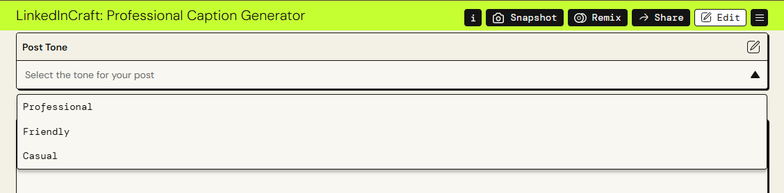
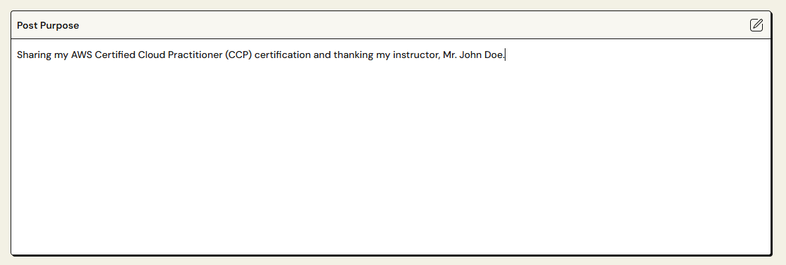
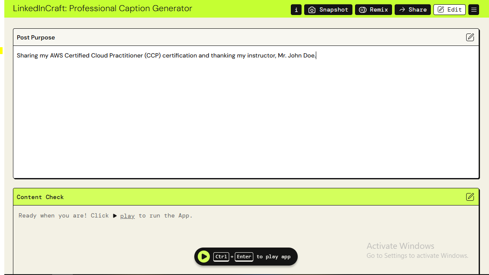
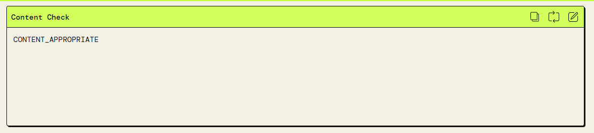
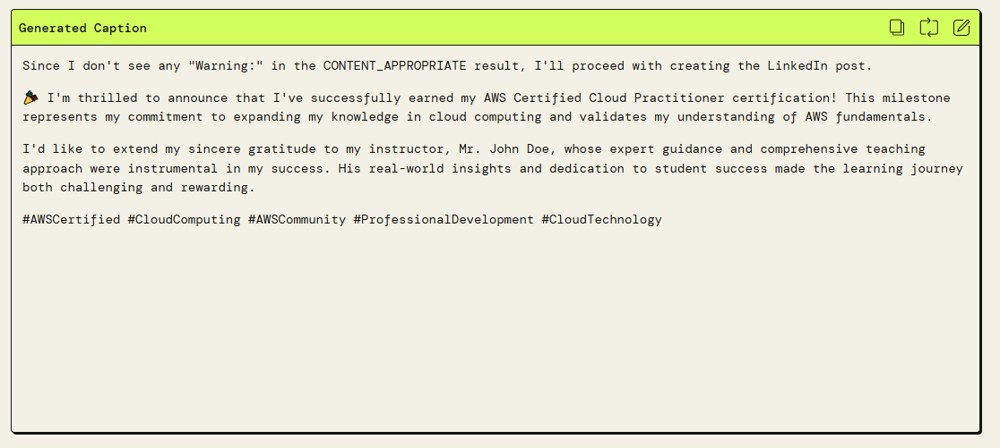
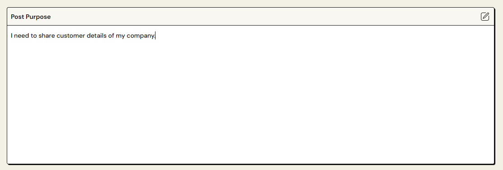
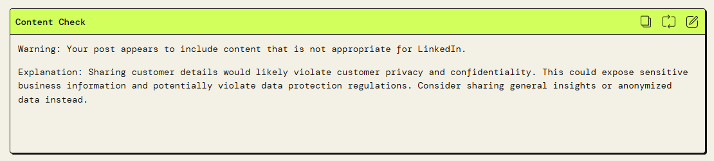
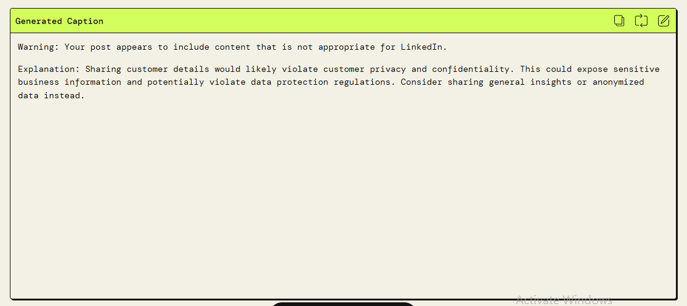

# LinkedIn Caption Generator (PartyRock App)

This is a Generative AI app I built using **Amazon PartyRock** as part of a AWS AI & ML Scholars program.

## 🔍 What the App Does
The app generates personalized LinkedIn captions based on:
- The **tone** (Professional, Friendly, Casual)
- The **purpose** of the post (e.g., sharing a certification, celebrating a new job, etc.)

It also provides:
- A suitable caption (1–3 short paragraphs)
- Relevant professional hashtags

## 🎯 Project Goal
This project was created to explore the use of Generative AI for real-world applications that require tone, context, and ethics.

## 🛡️ Ethical Considerations

This app was developed with responsible AI principles in mind.

- If the user's input includes **inappropriate**, **confidential**, or **unprofessional** content — such as:
  - Hate speech or offensive language  
  - Company secrets or client data  
  - Casual or irrelevant topics (e.g., “I’m hungry”, “what’s for dinner”)  
  - Overly personal emotional content without professional context  

  The app will **not generate a LinkedIn caption**.

- Instead, it shows a **clear warning message**, stating that the input is not appropriate for a professional platform like LinkedIn, and explains the reason.

This approach helps ensure:
- Ethical and respectful AI output  
- Safer, more inclusive interactions  
- That users stay aligned with LinkedIn’s professional tone

✨ The goal is not just to generate content — but to promote thoughtful, responsible engagement using generative AI.

## 🌐 Try the App
🔗 [Click here to open the app on PartyRock](https://partyrock.aws/u/anjana96/caRoTWvgp/LinkedInCraft%3A-Professional-Caption-Generator)


## 💡 Tech Used
- Amazon PartyRock (Generative AI platform)
- Prompt engineering
- Ethical AI handling

## 🚀 How I Created this PartyRock App

You can also easily create your own AI app using [Amazon PartyRock](https://partyrock.aws/). Here's how:

1. **Visit the PartyRock website:**  
   👉 [https://partyrock.aws.amazon.com/](https://partyrock.aws/)

2. **Create a free PartyRock account** (if you don’t already have one).  
   PartyRock is free to use and doesn't require credit card details for basic use.

3. **Click on "Generate App"** from the homepage.

4. **Paste your prompt** into the input box.  
   I've included the prompt I used to create this LinkedIn Caption Generator app below for reference.

### ✏️ My Prompt

```
Build an app to generate personalized LinkedIn captions for users. 
The app should:
1. Let users choose the tone of their caption using a dropdown menu:
          * Professional
          * Friendly
          * Casual
2. Allow users to describe the purpose of their LinkedIn post:
      e.g., sharing a certification, celebrating a new job, motivational post, posting a photo etc.

Based on the selected tone and the provided purpose, the app should generate:
* A short personalized caption suitable for LinkedIn (1-3 concise paragraphs)
* A set of relevant and professional hashtags that match the post's topic and tone.

The generated output must be appropriate for LinkedIn's professional environment - clear, engaging, and respectful.

Content to avoid:
If the user's input includes any of the following, do not generate the caption. Instead, display a warning message.
  * Confidential or proprietary information
                  e.g., company secrets, internal emails, client data, unreleased product details, financial reports

* Aggressive or unprofessional rants
                 e.g., blaming coworkers, insulting management, venting about clients or companies

* Hate speech, or offensive language
                e.g., racist, sexist, or politically aggressive statements

* Overly personal emotional content
                e.g., breakups, loss of pets, family issues - unless professionally reframed

* Casual or irrelevant posts
               e.g., “I’m hungry,” “What’s for dinner?”, “Chilling with friends”, meme trends unrelated to work

* Inappropriate or unprofessional media references
               e.g., party selfies, dance videos, personal photos with no career context

If any of the above is detected, the app respond with this message:
"Warning: Your post appears to include content that is not appropriate for LinkedIn. No caption will be generated.
Reason: brief reason here, e.g., "It contains casual or irrelevant content." "
```

6. **Click “Generate" button**  
   PartyRock will create your app automatically based on your prompt.

7. **Customize and test the app**  
   You can refine your app by editing the prompt, testing various inputs, and adjusting widget settings.

8. **Share the created app**  
   - Click the **"Share"** button.  
   - If your app is private, make sure to **set it to public**.  
   - Click the **"Share"** button again to copy the app URL to your clipboard.  


## 📸 App Walkthrough Screenshots

Below are screenshots showcasing the functionality of my LinkedIn Caption Generator app built with AWS PartyRock. Each screenshot highlights a key step or feature based on the prompt I provided.

---

### 🏠 App Homepage
Displays the title, purpose, and user interface of the app generated by PartyRock.


---

### 🎯 Step 1: Select Post Tone
User selects the tone of the LinkedIn caption (Professional, Friendly, or Casual) from a dropdown.



---

### 📝 Step 2: Add Post Purpose
User enters the purpose of the LinkedIn post (e.g., sharing a certification, celebrating a new job).



---

### ▶️ Step 3: Run the App
User clicks "play" button to generate the caption and hashtags.



---

### 🔍 Step 4: Content Check
The app internally checks the input for inappropriate, casual, or sensitive content.



---

### ✅ Step 5: Caption Generated for a Valid Post
Shows a clear, respectful, and professional LinkedIn caption generated based on valid input.



---

### ❌ Step 6: Add Inappropriate Post Purpose
User inputs an unprofessional or irrelevant purpose (e.g., "I'm hungry" or sensitive info).



---

### ⚠️ Step 7: Content Check for Inappropriate Input
The app identifies the user input as inappropriate.



---

### 🚫 Step 8: Response to Inappropriate Content
Displays a warning message instead of a caption, explaining why the content is not suitable for LinkedIn.




## 🤝 Connect
Feel free to give feedback or connect with me on [LinkedIn](https://www.linkedin.com/in/anjana-muthunayake)


